# LINE Chatbot — "พลังสมองสร้างได้ที่บ้าน" (Brain Power Built at Home)

> [!IMPORTANT]
> **Portfolio Snapshot Notice:** โฟลเดอร์นี้เป็น **ตัวอย่างเพื่อโชว์แนวคิด/สถาปัตยกรรม** เท่านั้น ไม่ใช่โปรเจคทั้งหมดแบบ production-ready.
> - ส่วนที่เป็น **business logic / content / data / integration จริง** ถูกตัดออกหรือทำเป็น **stub** เพื่อเก็บเป็นความลับ
> - โค้ดฝั่ง **DB / LLM / RAG / Embedding / external forms** ใน snapshot อาจถูกปิด/จำลองพฤติกรรม (ไม่ใช่ระบบจริง)
> - ไม่มีการใส่ secret/credential ใน snapshot นี้

> [!NOTE]
> **Language:** This chatbot is currently only available in **Thai**.
>
> **Research Status:** This bot is currently in the data collection phase for research.
> You may receive frequent notifications for data logging purposes,
> but please feel free to continue your testing.

> [!IMPORTANT]
> **Repository Disclosure:** This repository has been authorized by the client to be publicly visible.
> Only non-sensitive source code is shared here — **no research data, participant records, or database contents are included**.
> All credentials and secrets are managed via environment variables and are not committed to this repo.
>
> **Refactor Status:** This repository is currently undergoing a structural refactor (extracting `handleEvent` into modular handlers).
> The **production system runs a separate pre-refactor branch**; this repo will be merged back after a full regression test pass post-refactor.

## TL;DR (Above the Fold)

- **What it is:** A research-grade LINE chatbot that delivers a structured 6-week parent-child activity program (Thai-only).
- **What problem it solves:** Keeps users on a controlled timeline, persists multi-step activity state, and provides research-aligned AI feedback per answer.
- **Technical highlights:** RAG pipeline with dual-axis similarity + LLM reformulation, per-user mutex lock for race-free state, and modular handler architecture for maintainability.

**Impact / usage proof**

- Used by real participants during the research period (≈50 parents/guardians), with progress persisted and resumed across sessions.

## Demo (Screenshots)

Short, visual walkthrough of key UI/behavior (Thai UI).

### 1) Pre-activity lock state (guard before starting)

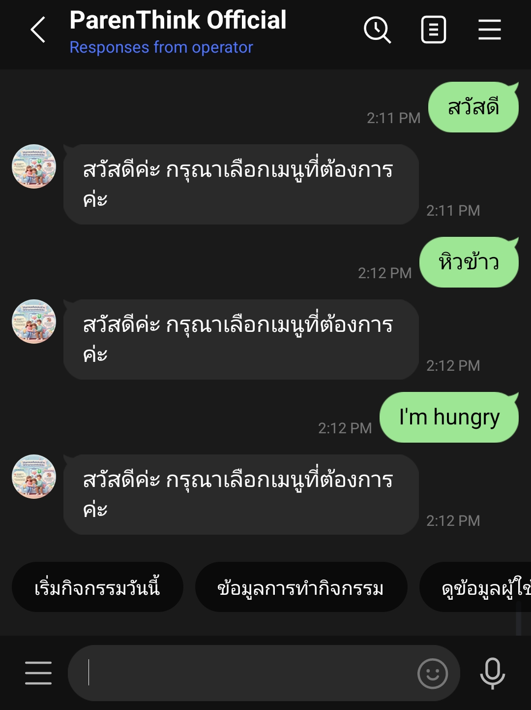

- What this shows: If the user has not pressed “เริ่มกิจกรรมวันนี้”, then no matter what they type, the bot replies with a safe greeting + quick-reply menu.
- Why it matters: Prevents users from burning AI credits outside the intended flow, and reduces the risk of corrupting conversation state in a timeline-driven activity program.

### 2) Rich menu overview

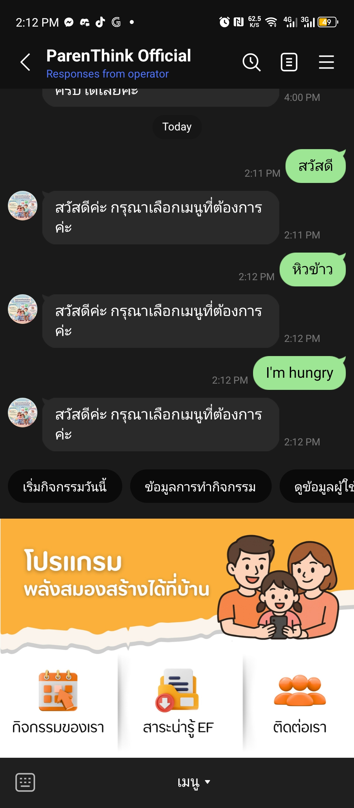

- What this shows: The clickable rich menu entry points used to navigate the bot.

### 3) External EF knowledge website (via rich menu)

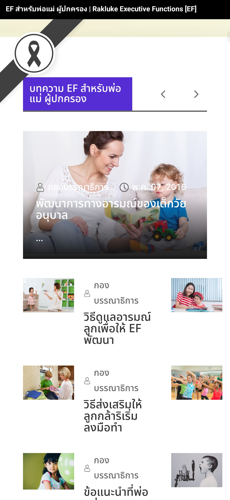

- What this shows: Tapping the rich menu button “สาระน่ารู้ EF” opens an external website with additional EF learning resources.

### 4) Contact channel (content owner)

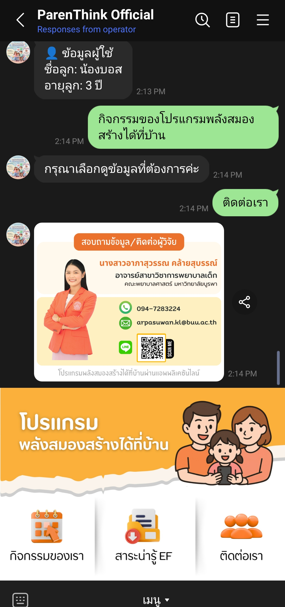

- What this shows: A contact card/image with the official contact channel for the content owner (Burapha University faculty).

### 5) Quick menu examples before starting activity

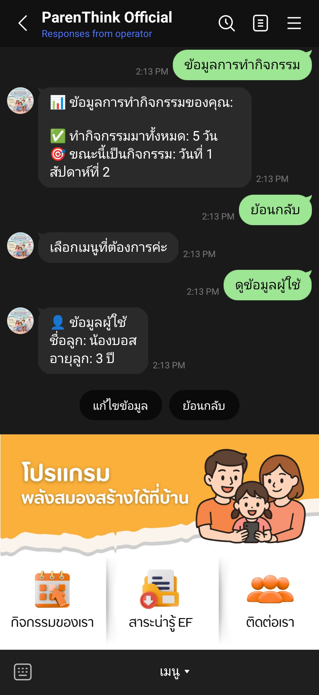

- What this shows: Users can still access informational views (e.g., number of completed activity days, child name that the user registered) even before starting today’s activity.

### 6) Start today’s activity (enter the daily flow)

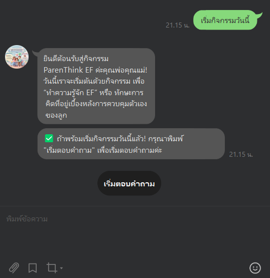

- What this shows: Tapping “เริ่มกิจกรรมวันนี้” transitions the user into the daily activity flow.
- Why it matters: Confirms the bot sets the right activity flags/pointers and starts serving questions.

### 7) Research-period guard: force “Start answering” via button-only input


- What this shows: If the user sends any other input instead of pressing the “เริ่มตอบคำถาม” button, the bot asks the user to choose from the provided buttons only.
- Why it matters: During the research period, the flow is intentionally constrained to keep participants on-track and to prevent state corruption from unexpected free-text input.
- Note: In a future public version, a “ย้อนกลับ” (Back) button can be added to improve navigation while keeping the state machine safe.

### 8) Activity question example (how prompts are served)

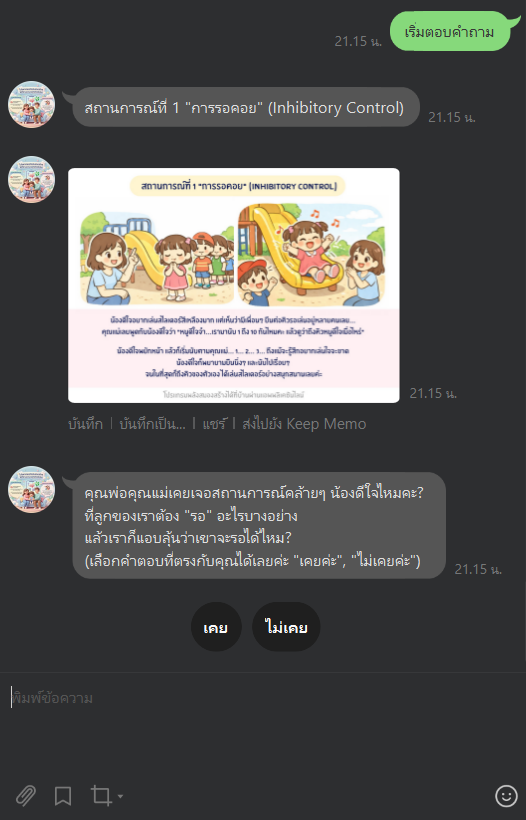

- What this shows: An example of the bot serving an activity question to the user.

### 9) Answer + AI feedback + “Next activity” CTA

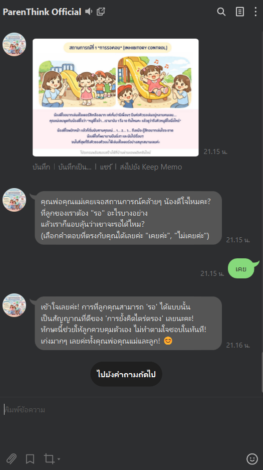

- What this shows: A user answer followed by the bot’s feedback, plus a “กิจกรรมถัดไป” (Next activity) button to continue the program.

### 10) Fast-answer prevention (mutex lock to protect state)

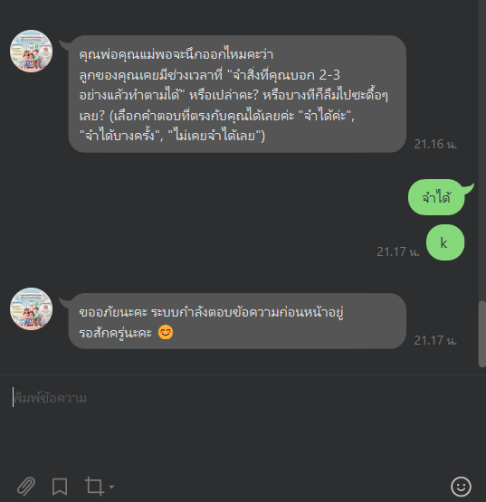

- What this shows: If a user sends messages too quickly while the backend model is still processing, the bot prevents concurrent handling to avoid breaking question order/state.
- Why it matters: Protects `current_question_number` / `current_sub_question_order` from race conditions caused by rapid-fire user input.

### 11) Game-style activities (common from Week 2 onward)

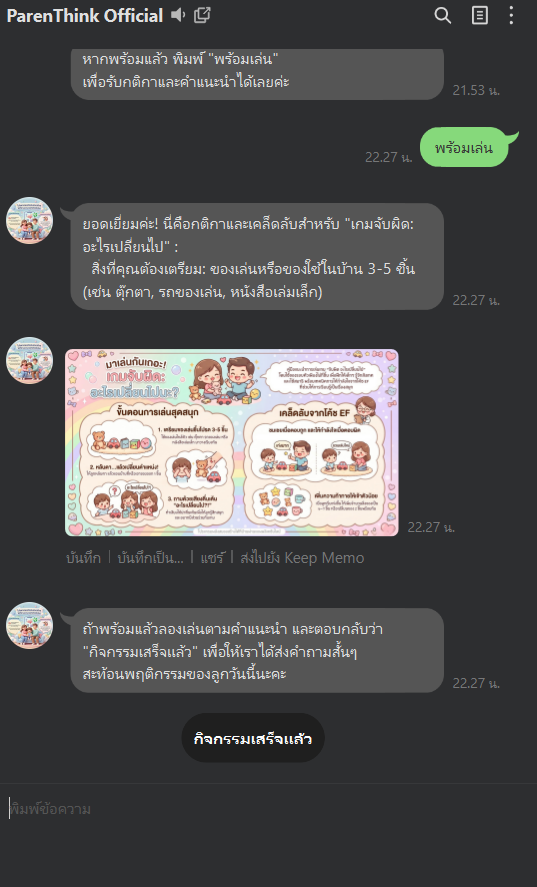

- What this shows: Many activities (especially from Week 2 onward) run like a “game”: the bot explains the activity first, the parent/child completes it offline, then the user returns to answer the follow-up prompts.
- Why it matters: This structure keeps the activity instructions clear and prevents the conversation from mixing “instruction” vs “answer” steps.

### 12) Sub-questions → accumulate answers → generate one consolidated feedback

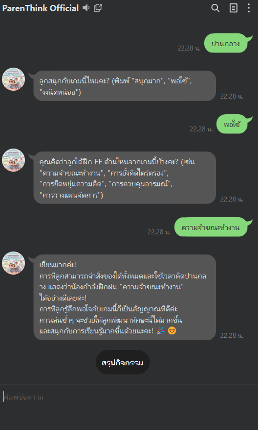

- What this shows: For some activities, the bot does not generate feedback immediately after each sub-question. Instead, it stores each sub-answer (per `sub_question`) and generates feedback once at the end of the game / end of the main activity.
- Why it matters (technical): By aggregating sub-answers and referencing each `sub_question` in a single prompt, the model receives one complete activity context — improving coherence and reducing fragmented feedback.


> Scan to add the Parenthink LINE chatbot and try it out.

A research-grade LINE chatbot developed in collaboration with the **Faculty of Nursing, Burapha University**, as part of an academic research project aimed at promoting **Executive Function (EF)** development in young children. The chatbot delivers structured daily activities and educational content derived directly from the research team's clinical and pedagogical documentation, ensuring that all responses and feedback align with the ethically reviewed materials.

Parents/guardians interact daily with structured activities, receive personalized AI-driven feedback, and are guided through a full 6-week program timeline managed centrally by the research team.

---

## Tech Stack

| Layer              | Technology                                         |
| ------------------ | -------------------------------------------------- |
| Runtime            | Node.js                                            |
| Messaging Platform | LINE Messaging API (`@line/bot-sdk`)               |
| Database           | PostgreSQL (`pg`)                                  |
| Generative AI      | OpenAI GPT-4o-mini / Google Vertex AI (switchable) |
| Thai Embedding     | WangchanBERTa (custom Python microservice)         |
| Scheduler          | `node-cron`                                        |
| Deployment         | PM2 (`ecosystem.config.cjs`)                       |

---

## Section 1 — General Features

What the chatbot does from a user perspective:

### 1. User Registration & Pre-Program Survey

When a user first adds the LINE bot, the system registers them in the database (stored by LINE User ID), then sends questions to store users' information (such as the kid's name, kid's age).

### 2. Structured 6-Week Daily Program

The program runs over **6 weeks × 5 weekdays**, totaling 30 activity days. Each day has one or more questions tied to EF (Executive Functions) concepts. The chatbot guides users through each day's activity in order, and progress is saved so users can pause and return at any time.

- Users begin by pressing **"เริ่มกิจกรรมวันนี้"** (Start Today's Activity)
- Questions are served sequentially based on the user's current `week` and `day` pointers (using the database to store pointers as a table column to make these pointers become the source of truth)
- Additional info about EF is sent to users on weekends (Saturday-Sunday) since there aren't activities for users like on weekdays.

### 3. Instant AI-Powered Feedback per Answer

After the user answers a daily open-ended question, the chatbot:

1. Retrieves the most relevant pre-approved expert answer from the FAQ database (via RAG)
2. Sends it through a generative AI model to rephrase it contextually
3. Delivers personalized, research-validated feedback

### 4. Interactive Activities

Certain activity days use a **game mode** with multi-step sub-questions. Sub-questions can be:

- **Open-ended** — free text answers
- **Yes/No** — rendered as quick-reply buttons ("เคย" / "ไม่เคย")
- **Multiple choice** — rendered as quick-reply buttons from database choices
- **Describe** — informational text with a "ไปยังคำถามถัดไป" (Next Question) prompt

At the end of a game, collective feedback summarizing all sub-answers is generated via AI.

### 5. Daily Reminders via Scheduled Jobs

`node-cron` fires daily reminder messages to all active users who have not yet started their day's activity. Failed deliveries are queued and retried within a configurable time window.

### 6. Central Timeline Control [*Only in "Research period" (Late April to early June)]

Controls the program's current week/day through a single `central_timeline` table. All users follow this master timeline, ensuring synchronized program delivery across all participants. Users cannot proceed beyond the current central timeline, but if they fall behind, they can catch up on all missed activities in one go (or gradually complete activities at their own pace when they have free time).

---

## Section 2 — Technical & Functional Highlights

What makes this chatbot non-trivial under the hood:

---

### RAG Pipeline — Dual-Axis Similarity Matching + Generative Reformulation

Most RAG implementations embed the user's query, find the nearest document, and return it. This chatbot uses a **two-stage pipeline** designed specifically to satisfy research ethics requirements (using wording as similar to the research document as possible) — approved answer phrasings must be preserved, while responses still feel natural for each individual user's phrasing.

#### Stage 1 — Structured FAQ Retrieval (Multi-Fallback)

The system searches for the best-matching FAQ through a cascading strategy:

```
Exact string match
        ↓ (miss)
Embedding cosine similarity on (question_text × 0.8) + (user_answer × 0.2)
        ↓ (score < threshold 0.85)
String similarity fallback (same weighted formula)
        ↓ (still no match)
Broader search across all questions in the same day/week
        ↓ (still no match)
Day-wide FAQ pool search (lowest threshold, last resort)
```

The key design decision is scoring **both axes simultaneously**:

- `question_text` similarity (80% weight) — is this the right question context?
- `user_answer` similarity (20% weight) — does the user's answer pattern match this FAQ entry?

This matters because the same question can have very different appropriate responses depending on how the user answers (e.g., "เคย / 3" vs "ไม่เคย / 1" trigger different feedback).

Thai text embeddings are computed by a locally hosted **WangchanBERTa** microservice (`/Embedding_Server_wangchanberta/`), chosen for its strong Thai-language semantic understanding. An **in-memory embedding cache** (`embeddingClient.js`) avoids redundant API calls for repeated FAQ texts.

#### Stage 2 — Generative AI Reformulation

After the best-matching FAQ answer is retrieved, it is **not returned using exract words as the similar RAG**. Instead, it is sent to a generative AI model (OpenAI `gpt-4o-mini` or Google Vertex AI, switchable via `LLM_PROVIDER` env var) with a prompt that instructs the model to:

- **Preserve the structure and key information** of the approved answer (required for research ethics compliance)
- **Adjust the tone and phrasing** to naturally fit the user's specific input

> This approach was chosen because the researcher needed chatbot responses to closely resemble the ethically reviewed answer forms while still feeling personalized — a direct template match would be too rigid for users whose phrasing varies significantly.

---

### Per-User Mutex Lock — Handling Rapid-Fire Messages

LINE users can send multiple messages faster than the bot can process them (especially while waiting for AI responses that may take 2–5 seconds). Without protection, this causes:

- Duplicate DB writes
- Race conditions on user state fields
- Corrupted `current_question_number` or `current_sub_question_order`

**Solution (`utils/userLock.js`):** An in-memory per-user mutex with TTL and auto-refresh.

```
User sends message → tryAcquireUserLock(userId)
      ↓ success              ↓ already locked
  Process event         Silently drop/ignore
  (AI call, DB writes)
      ↓
  releaseUserLock(userId)
```

Key implementation details:

- Lock TTL defaults to **120 seconds** — covers even slow AI roundtrips
- `startUserLockAutoRefresh()` extends the TTL on a timer so the lock does not expire mid-processing for very long operations
- The interval timer calls `.unref()` so it does not keep the Node.js process alive unnecessarily
- Lock is released in a `finally` block to guarantee release on error paths

---

### Persistent Activity State & Resumption

All user progress is stored in PostgreSQL on every step:

| Field                        | Purpose                                        |
| ---------------------------- | ---------------------------------------------- |
| `current_week`               | Which program week the user is on              |
| `current_day`                | Which weekday within that week                 |
| `current_question_number`    | Which main question within the day             |
| `current_sub_question_order` | Which sub-question within a game/self-activity |
| `is_in_activity`             | Whether the user is mid-activity right now     |
| `has_started_today`          | Whether the user started today's activity      |

If a user closes the chat mid-activity and returns hours later, the bot restores exactly where they left off — no data loss, no restart required.

---

### Stuck State Detection & Recovery

A subtle edge case: the daily cron job resets `has_started_today = false` and `is_in_activity = false` at midnight, but the user's `current_question_number` or `current_sub_question_order` may still point to a mid-activity position. This creates a "stuck" state where the user cannot proceed because the activity flags say they haven't started, but the question pointer is already past question 1.

`hasStuckActivityPointers(user)` detects this condition:

```js
// Stuck if question pointer is past default (1) OR sub-question pointer is set
// while daily flags have been reset
const hasNonDefaultQuestion = qNum !== 1;
const hasSubPointer = user.current_sub_question_order != null;
return hasNonDefaultQuestion || hasSubPointer;
```

When detected, the bot automatically re-presents the pending question to the user so they can continue seamlessly.

---

### Central Timeline Gating

The research coordinator advances the program day/week via the `central_timeline` table rather than automatic time-based progression. This gives the team full control over the program pace.

- Users **cannot advance beyond** the current central timeline day (prevents users from rushing ahead)
- Users who are **behind** the central timeline receive a message showing how many days they are behind, plus a quick-reply button to continue immediately
- The system calculates the timeline index as `(week - 1) * 5 + day` (Mon–Fri, 5 activity days per week), correctly handling weekend skipping via `Intl.DateTimeFormat`

---

### LINE API Safety Layer

All outgoing messages pass through a sanitization pipeline before hitting the LINE API:

- **Message text sanitization** — strips/truncates content that would cause LINE API rejections
- **Quick Reply label truncation** — LINE enforces a 20-character limit on quick-reply button labels; `truncateLineLabel()` handles this automatically
- **Batch splitting** — LINE allows max 5 messages per API call; `replyThenPushInBatches()` automatically splits larger message arrays
- **Reply-token fallback** — reply tokens expire after ~30 seconds; if `replyMessage()` fails with a token error, the bot falls back to `pushMessage()` using the stored LINE User ID so the user still receives the response

---

## Project Structure

```
index.js                  — Main webhook handler and event router (orchestration core)
cronJob.js                — Daily reminders, timeline auto-advance, retry queue
feedback.js               — Per-answer feedback delivery logic
adminNotifications.js     — Admin progress report scheduler
handlers/
  onboardingHandler.js    — User registration flow (name / birthday / child-code steps)
  menuHandler.js          — Static info commands (about, calendar, research, contact)
  adminHandler.js         — Admin-only day/week selection flow
  activityHandler.js      — Activity lifecycle (start / resume / next / summary / game sub-questions)
  gameHandler.js          — Game-mode sub-question flow and collective feedback
utils/
  ragFeedback.js          — Full RAG pipeline (retrieval + AI reformulation)
  embeddingClient.js      — WangchanBERTa client with in-memory cache
  llmClient.js            — Unified LLM abstraction (OpenAI / Vertex AI)
  userLock.js             — Per-user in-flight mutex
  lineClient.js           — LINE API helpers, sanitization, reply-fallback
  dateHelpers.js          — Timezone-aware date utilities (Intl-based)
  weeklySurveys.js        — Weekly check-in survey push logic
Embedding_Server_wangchanberta/
  main.py                 — FastAPI embedding server
  wangchanberta_embedding.py — WangchanBERTa model loader
```

---

## Folder Architecture

The project is organized around a **Chain-of-Responsibility + Modular Handler** pattern.
`handleEvent` in `index.js` acts as the orchestrator: it calls each handler in priority order and returns early on the first one that handles the message. Handlers that do not own the current message return `null` and pass control to the next handler in the chain.

| Folder / File                     | Architectural Role                                                                                              | Separation Rationale                                                                                                                   |
| --------------------------------- | --------------------------------------------------------------------------------------------------------------- | -------------------------------------------------------------------------------------------------------------------------------------- |
| `index.js`                        | **Orchestrator** — webhook entry point, user lock, central timeline gating, stuck-state recovery, handler chain | Owns cross-cutting concerns (auth, locking, gating) that must run before any domain handler                                            |
| `handlers/`                       | **Domain Handlers** — each file owns one user-facing flow                                                       | Separated by _user intent / conversation state_, not by question type; one handler = one conversation context                          |
| `handlers/onboardingHandler.js`   | Handles `profile_step` registration flow (multi-turn)                                                           | Isolated because it must interrupt all other flows when `profile_step` is active                                                       |
| `handlers/menuHandler.js`         | Handles stateless info commands (about, calendar, contact…)                                                     | Pure read-only replies with no DB side-effects; safe to call at two points in the chain (buttons stage + fallback stage)               |
| `handlers/adminHandler.js`        | Handles admin-only day/week selection                                                                           | Gated by `user.is_admin`; separated to avoid polluting the main user flow with admin state                                             |
| `handlers/activityHandler.js`     | Handles the full activity lifecycle (start → answer loop → summary → pending confirm → game sub-questions)      | Largest domain; owns all activity-state mutations (`has_started_today`, `is_in_activity`, `current_question_number`)                   |
| `handlers/gameHandler.js`         | Handles game sub-question fan-out and collective AI feedback generation                                         | Separated because game flow requires its own sub-question pointer (`current_sub_question_order`) and multi-step DB state               |
| `utils/`                          | **Infrastructure / Cross-cutting Utilities**                                                                    | Separated by _technical capability_, not by feature; each util is stateless or manages a single shared resource                        |
| `utils/ragFeedback.js`            | RAG retrieval + generative reformulation pipeline                                                               | Isolated as a pure async function; has no knowledge of LINE or user state                                                              |
| `utils/embeddingClient.js`        | WangchanBERTa HTTP client + in-memory cache                                                                     | Separated to allow cache lifetime to be controlled independently of request lifetime                                                   |
| `utils/llmClient.js`              | Unified LLM abstraction (OpenAI / Vertex AI)                                                                    | Provider-switching logic stays in one place; callers are provider-agnostic                                                             |
| `utils/userLock.js`               | Per-user in-flight mutex (TTL + auto-refresh)                                                                   | Separated because locking must be acquired before any business logic runs                                                              |
| `utils/lineClient.js`             | LINE API helpers — sanitization, label truncation, batch splitting, reply-fallback                              | Centralizes all LINE API safety rules so no handler needs to duplicate them                                                            |
| `utils/dateHelpers.js`            | Timezone-aware date utilities (`Intl`-based, no external deps)                                                  | Separated to avoid duplicating timezone logic across cron, gating, and handlers                                                        |
| `Embedding_Server_wangchanberta/` | **External Microservice** — Python/FastAPI embedding server                                                     | Deployed independently; decoupled from Node.js runtime so the embedding model can be upgraded or swapped without touching the main bot |

---

## Validation / Quality (Draft)

This repository is a production-derived codebase with a **manual-first validation approach** (LINE + PostgreSQL + external AI services make full public reproduction non-trivial). The bot has been used by real participants during the research period.

### Validation approach

- **Primary:** Manual testing on real conversation flows (message → DB state update → reply/push).
- **Secondary:** Basic runtime safety checks (syntax checks, linting where applicable) and staged refactor sessions with behavior-preserving extraction.

### Manual test checklist (8–12 key flows)

Use this as a regression checklist after each refactor session.

1. **Onboarding start**
   **Precondition:** New user (no DB row) or user has `profile_step` set.  
   **Input:** Follow event or any text.  
   **Expected:** Bot prompts for the next required profile field and does not enter activity flow.
   - to make sure user put all neccessary infomation before start the program \*

2. **Start today’s activity**
   **Precondition:** Registered user, not in activity.  
   **Input:** `เริ่มกิจกรรมวันนี้`  
   **Expected:** Sets daily flags (`has_started_today`, `is_in_activity`) and replies with the first question / start prompt.

3. **Guard: answer requires activity started**
   **Precondition:** Registered user, `has_started_today=false` and `is_in_activity=false`.  
   **Input:** Any answer-like text to a question type that requires activity state.  
   **Expected:** Bot replies with “กรุณากด "เริ่มกิจกรรมวันนี้" ก่อนค่ะ” plus a quick reply button.
   - to make sure users has to check which activities they're currently on (which day and whcich week) since backend have to check whatever user answer to which question, this ensure the state users are in.

4. **Confirm pending answer — yes**
   **Precondition:** Pending confirmation is shown.  
   **Input:** `ใช่ ส่งเลย`  
   **Expected:** Pending answer is persisted to the correct table, feedback is generated/sent if applicable, and the bot advances pointers.

5. **Game flow — Yes/No sub-question**
   **Precondition:** User is in a game question (`question_type=game`) and `current_sub_question_order` points to a Yes/No sub-question.  
   **Input:** Tap quick reply (e.g., “เคย/ไม่เคย”).  
   **Expected:** Sub-answer is saved, pointer advances to the next sub-question, and the bot replies with the next sub prompt.

6. **Game flow — Describe/Next**
   **Precondition:** User is in a game sub-question of type describe.  
   **Input:** `ไปยังคำถามถัดไป`  
   **Expected:** Bot advances without requiring a text answer and serves the next sub-question.
   - sometimes put all describe about the question in one buble can be hard to read, but if separate to another bubble bot can confuse if it another question or not. We can set that bubble into "descrivbe" type so bot know it just information and ready for the next real question.

7. **Stuck-state recovery after midnight reset**
   **Precondition:** User has question pointers (e.g., `current_question_number != 1` or `current_sub_question_order != null`) but daily flags were reset.  
   **Input:** Any text message.  
   **Expected:** Bot offers resume vs restart; resume restores flags and replays the current pending question/sub-question.

   when users do the activities, bot have to check many flags to ensure which question users are currently on. ( such as current_question_number, current_sub_question_order, is_in_activity, has_started_today ). But sometimes users just leave the activities and there will be many problems later (such as, user comeback later and forget the activity and want to restart or some update affect users flags and it can be crash)
   so i added logic to always check users'flags
   to prevent bugs and give users chocies to resume or restart the activity in the same time.

8. [ only for reserch period, will remove this after fully lunch to public ]
   **Central timeline gating (ahead of schedule)**
   **Precondition:** User is ahead of `central_timeline` and is not admin.  
   **Input:** Activity-related commands (start/next/summary).  
   **Expected:** Bot blocks progression and resets activity state to a safe baseline.

9. **Menu/info commands are stateless**
   **Precondition:** Any registered user.  
   **Input:** Menu commands (about/calendar/research/contact).  
   **Expected:** Bot replies with informational text and does not mutate activity pointers.
